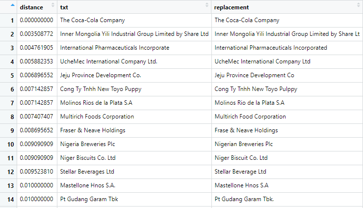

# fuzzymatch

Helps to find inexact matches (e.g. Nestlé vs Nestle) in text data.

``` r
devtools::install_github("richardvogg/fuzzymatch")
```

Short example from [TidyTuesday](https://github.com/rfordatascience/tidytuesday) (Week 5 - 2021)

## Load data

```r
tuesdata <- tidytuesdayR::tt_load('2021',5)
plastics <- tuesdata$plastics
```

## Find a good cutoff value

```r
dedupes <- fuzzymatch::fuzzy_dedupes(plastics$parent_company,find_cutoff=TRUE)
```


The output is sorted by closest stringdist. I checked that I would have the Nestlé / Nestle difference covered (which was at 0.067).

## Remove fuzzy duplicates

```r
plastics$parent_company <- fuzzymatch::fuzzy_dedupes(plastics$parent_company,cutoff_distance = 0.08)
```

## Work with cleaner data

I was looking for the top 5 polluters. As Nestle is definitely one of them, I needed the data to be as clean as possible.
